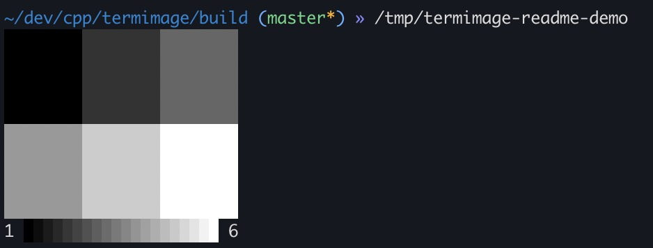

# peep

`peep` is a small header-only C++11 library for printing data as color images directly to the terminal.

It is not trying to be a graphics stack. It is for the moment when you have an image, matrix, or data buffer in C++ and you want to visualize it right now without pulling in OpenCV, SDL, Qt, matplotlib, etc.

```cpp
#include <peep/peep.hpp>

int main() {
    int data[] = { 1, 2, 3, 4, 5, 6 };
    peep::print(data, 2, 3); // interpret as a 2x3 matrix
}
```

That prints ANSI truecolor half-blocks. If your terminal supports 24-bit color, you will see a matrix displayed as an image:



## Why does this exist?

Sometimes importing a real graphics library is impractical or just more work than you want to do.  Sometimes you need a quick answer to questions like:

- What's in this array?
- Is this buffer transposed?
- Did my RGB channel order get scrambled?
- Did this crop grab the thing I think it grabbed?
- Did NaNs creep into my matrix somewhere?
- Is there structure in this data?

## Features

- Print any numeric data buffer
- Print RGB images from interleaved or planar 8-bit data out of the box
- Support for row-major and column-major memory layouts
- Print your own custom types by defining an accessor function
- Includes built-in colormaps from [matplotlib](https://matplotlib.org/): `gray`, `viridis`, `plasma`, `inferno`, `magma`, `cividis`, `coolwarm`, `gnuplot`, `turbo` (or load your own)
- Render a colorbar and configure color limits
- NaN and infinity handling
- Crop out and display only a part of your buffer
- Automatic block upsampling of small arrays
- Can resample arrays too large to render in the terminal
- `to_string()` when you want the ANSI output but do not want to write it yet
- All options are configurable

## Quickstart

### Two-dimensional data

```cpp
#include <peep/peep.hpp>
#include <vector>

int main() {
    std::vector<double> img = {
        0.0, 0.2, 0.4, 0.6,
        0.1, 0.3, 0.5, 0.7,
        0.2, 0.4, 0.6, 0.8,
        0.3, 0.5, 0.7, 1.0
    };

    peep::print(img, 4, 4, peep::Options()
        .colormap("magma")
        .clim(0.0, 1.0)
        .title("score matrix"));
}
```

### RGB data

RGB input is plain `uint8_t` data. Interleaved means `RGBRGBRGB...`.

```cpp
std::vector<std::uint8_t> rgb = {
    255, 0, 0,     0, 255, 0,
    0, 0, 255,     255, 255, 255
};

peep::print(rgb, 2, 2, peep::Options()
    .rgb()
    .block_size(4)
    .fit(peep::Fit::Off)
    .title("rgb sanity check"));
```

For planar data, use:

```cpp
peep::Options().rgb(peep::RGBLayout::Planar);
```

### Custom containers

If your image is not stored as a flat buffer, tell `peep` how to access your data:

```cpp
peep::print(rows, cols, peep::Options()
    .accessor([&](size_t r, size_t c) {
        return my_image.value_at(r, c);
    })
    .colormap("turbo")
    .title("from accessor"));
```

RGB accessors work the same way:

```cpp
peep::print(rows, cols, peep::Options()
    .rgb_accessor([&](size_t r, size_t c) {
        auto p = image.pixel(r, c);
        return peep::Color{p.red, p.green, p.blue};
    }));
```

## Options

`Options` is chainable, so you can usually read it left to right.

### Pick a colormap

```cpp
peep::Options().colormap("viridis");
peep::Options().colormap(peep::Colormap::Coolwarm);
```

Scalar images default to `gray`. RGB images ignore colormaps because the input is already color.  You can also set the default colormap once up-front to avoid specifying it every time.

```cpp
peep::set_default_colormap(peep::Colormap::Viridis);
```

### Control the color range

By default, `peep` scans finite values and uses the data min/max.

```cpp
peep::Options().clim(0.0, 1.0);   // fixed scale
peep::Options().clim_lo(0.0);     // auto high
peep::Options().clim_hi(255.0);   // auto low
```

Manual limits are useful when you want several images to use the same color scale.

### Enlarge tiny arrays

Some arrays are tiny, and when printed they appear tiny.  Use `block_size` to render every pixel as an `NxN` block of pixels of the same color.  By default it will try to set a block size that renders the image at a reasonable size without clipping the terminal. To override:

```cpp
peep::Options().block_size(1);  // render at the smallest size
peep::Options().block_size(4);  // render in 4x4 pixel blocks
```

### If your data doesn't fit the terminal

If the image is too large to fit in the terminal, by default it will resample it to fit.  You can configure this behavior:

```cpp
peep::Options().fit(peep::Fit::Resample); // default (BLI)
peep::Options().fit(peep::Fit::Trim);
peep::Options().fit(peep::Fit::Off);
```

`Fit::Resample` shrinks oversized images to fit the terminal via interpolation and also corrects for terminals whose half-block pixels are not physically square.

`Fit::Trim` tries to clip the data before it interacts with the edge of the terminal.

`Fit::Off` ignores the terminal bounds and just goes for it.  Use this when rendering exact dimensions matters more than fitting the terminal (but it will cause problems if the image is too large to fit the terminal).

### Print a cropped region

Crops are in `x, y, w, h` order.

```cpp
peep::Options().crop(20, 10, 64, 64); // left corner, w, h
peep::Options().center_crop(128, 96, 80, 60); // center pix, w, h
```

Crop windows can extend outside the source image. Out-of-bounds scalar pixels render as NaN. Out-of-bounds RGB pixels render as black. This makes fixed-size chips easy to request even near image borders.

### Deal with NaN and infinity

NaNs are transparent by default, which is often (but not always) what you want for masks and missing data.  If you're hunting for NaNs or Infs, you can set a special color:

```cpp
peep::Options().nan_color(255, 0, 255);
peep::Options().inf_colors(
    peep::Color{0, 0, 255}, // -inf
    peep::Color{255, 0, 0}); // +inf
```

Without explicit infinity colors, infinities map to the low/high ends of the colormap.

### Row-major & column-major memory layouts

Data buffer inputs (i.e. no custom accessor) are interpreted as row-major memory layout by default but it can be configured:

```cpp
peep::Options().layout(peep::Layout::RowMajor);
peep::Options().layout(peep::Layout::ColMajor);
```

### Capture instead of printing

```cpp
std::string ansi = peep::to_string(data, rows, cols,
    peep::Options().colormap("cividis"));
```

This is handy for tests, logs, or writing to a different stream yourself.

## Printing a real image

`peep` does not load PNG/JPEG/etc. `peep` prints buffers.

To make the RGB path concrete, the repo includes a plain-text PPM cat image at `assets/cat.ppm` and a small loader example:

```bash
cmake -S . -B build
cmake --build build
./build/ppm_demo
```

The important line in `examples/ppm_demo.cpp` is still just:

```cpp
peep::print(image.rgb, image.height, image.width, peep::Options()
    .rgb()
    .fit(peep::Fit::Off)
    .block_size(1));
```

Use whatever image loader you already have, fill a `std::vector<std::uint8_t>`, and hand it to `peep`.

## More examples

```bash
./build/demo
```

The demo shows:

- scalar gradients across the built-in colormaps
- an RGB color chart
- NaN holes
- infinity coloring
- center crops
- a large resampled surface

The examples are meant to be readable more than clever. If you are wondering how to configure a behavior, checking `examples/demo.cpp` is usually faster than spelunking the implementation.

## Building

It's a header-only library, so just:

```cpp
#include <peep/peep.hpp>
```

If you want the examples:

```bash
cmake -S . -B build
cmake --build build
```

By default this builds examples but not tests.

```bash
cmake -S . -B build -DPEEP_BUILD_EXAMPLES=OFF
cmake -S . -B build -DPEEP_BUILD_TESTS=ON
cmake -S . -B build -DPEEP_BUILD_BENCH=ON
```

## Using with CMake

Install it:

```bash
cmake --install build --prefix /path/to/install
```

Consume it:

```cmake
find_package(peep CONFIG REQUIRED)
target_link_libraries(my_target PRIVATE peep::peep)
```

## Tests

Tests use GoogleTest. CMake first looks for an installed GoogleTest package, then a local source tree such as `build/_deps/googletest-src` or `-DPEEP_GTEST_SOURCE_DIR=/path/to/googletest`.

To allow CMake to fetch GoogleTest live:

```bash
cmake -S . -B build -DPEEP_BUILD_TESTS=ON -DPEEP_FETCH_GTEST=ON
cmake --build build
ctest --test-dir build
```

## Requirements

- C++11
- A terminal with 24-bit truecolor support

## Conclusion

This is a debugging and exploration tool.

## License

MIT
