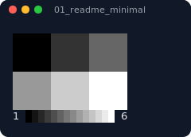
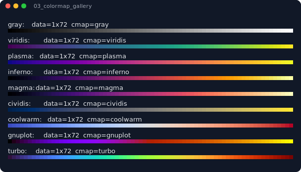
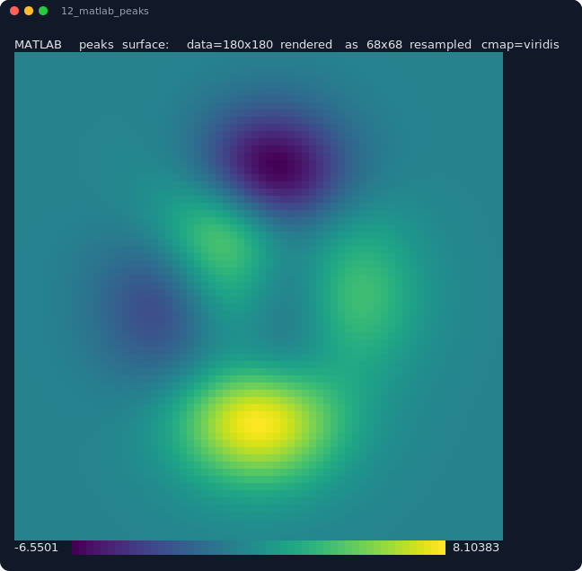
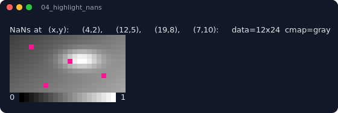
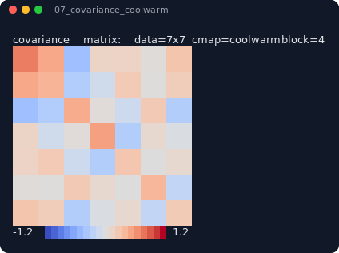
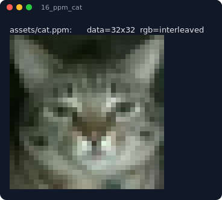
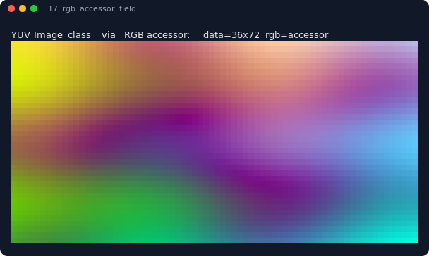

# peep

[](https://github.com/akfite/peep/actions/workflows/ci.yml?query=branch%3Amaster)
[](https://codecov.io/gh/akfite/peep)

`peep` is a small header-only C++11 library for showing data as color images directly in the terminal.  It is intended to be an easy-to-use debugging and visualization tool, not a real graphics stack.

```cpp
#include <peep/peep.hpp>

int main() {
    int data[] = { 1, 2, 3, 4, 5, 6 };
    peep::show(data, 2, 3); // as 2x3 matrix
}
```

If your terminal supports 24-bit color, you will see a matrix displayed as an image using ANSI half-block characters:



## Features

- Show any 2D numeric data or RGB image
- Includes built-in colormaps from [matplotlib](https://matplotlib.org/): `gray`, `viridis`, `plasma`, `inferno`, `magma`, `cividis`, `coolwarm`, `gnuplot`, `turbo` (or load your own)
- Render a colorbar and configure color limits
- Support for row-major and column-major memory layouts
- Show your own custom types by defining an accessor function
- Crop out and display only a part of your buffer
- NaN and infinity handling
- Automatic block upsampling of small arrays
- Can resample arrays too large to render in the terminal
- `to_string()` when you want the ANSI output but do not want to write it yet
- All options are configurable

## Examples

### Colormaps

[`examples/03_colormap_gallery.cpp`](examples/03_colormap_gallery.cpp) renders the same linear ramp with each built-in colormap.

```cpp
peep::show(values, rows, cols, peep::Options()
    .colormap("viridis")
    .clim(0.0, 1.0));
```



Scalar images default to `gray` if no colormap is specified. RGB rendering paths ignore colormaps.

### Visualize a 2D function ("peaks")

[`examples/12_matlab_peaks.cpp`](examples/12_matlab_peaks.cpp) renders a 2D function as an image with the `viridis` colormap.

```cpp
peep::show(surface, n, n, peep::Options()
    .colormap("viridis")
    .title("MATLAB peaks surface"));
```



### Highlight NaNs

[`examples/04_highlight_nans.cpp`](examples/04_highlight_nans.cpp) shows how to pinpoint the location of NaNs in an array.

```cpp
peep::show(instrument, rows, cols, peep::Options()
    .colormap("gray")
    .clim(0.0, 1.0)
    .nan_color(255, 20, 147)); // hot pink
```



Infinities can be handled the same way with `inf_colors()`. See [`examples/05_outliers_and_infinities.cpp`](examples/05_outliers_and_infinities.cpp).

### Covariance Matrix

[`examples/07_covariance_coolwarm.cpp`](examples/07_covariance_coolwarm.cpp) uses a diverging colormap and explicit color limits for a covariance matrix.

```cpp
peep::show(cov, features, features, peep::Options()
    .colormap("coolwarm")
    .clim(-1.2, 1.2)
    .block_size(4)
    .title("covariance matrix"));
```



Use fixed limits when comparing several arrays. Otherwise `peep` scans finite values and scales each image independently.

### RGB buffers

[`examples/16_ppm_cat.cpp`](examples/16_ppm_cat.cpp) loads a plain-text PPM cat image and passes the RGB bytes directly to `peep`, which interprets it as interleaved RGB by default:

```cpp
peep::show(image.rgb, image.height, image.width, peep::Options()
    .rgb() // peep::RGBLayout::Interleaved
    .block_size(1));
```



RGB input is plain `std::uint8_t` data. Interleaved layout means `RGBRGBRGB...`, and planar layout is available with `rgb(peep::RGBLayout::Planar)`.

### Displaying custom types

If your data is not stored as a flat buffer, pass dimensions directly and provide an accessor in `Options`. Scalar accessors return a value that `peep` maps through the selected colormap:

```cpp
peep::show(rows, cols, peep::Options()
    .accessor([&](size_t r, size_t c) {
        return image.value_at(r, c);
    })
    .colormap("turbo"));
```

RGB accessors return a `peep::Color` directly. [`examples/17_rgb_accessor_field.cpp`](examples/17_rgb_accessor_field.cpp) uses this path with a custom `Image` class that stores pixels as YUV and converts them to RGB on demand.

```cpp
peep::show(image.rows(), image.cols(), peep::Options()
    .rgb_accessor([&](size_t r, size_t c) {
        return image.rgb(r, c);
    }));
```



## Options

`peep::Options` setters are chainable. Later calls to source, crop, colormap, and special-value color setters replace earlier calls of the same kind.

| Option | Default | Effect |
| --- | --- | --- |
| `clim(lo, hi)`, `clim_lo(v)`, `clim_hi(v)` | Auto from finite visible values | Set scalar color limits. Values outside the range clamp to the nearest endpoint; either limit can remain auto. |
| `colormap(Colormap)`, `colormap("name")`, `colormap(lut)` | `default_colormap()` (`gray` initially) | Set the scalar palette. Names are `gray`/`grey`, `magma`, `viridis`, `plasma`, `inferno`, `cividis`, `coolwarm`, `gnuplot`, and `turbo`; custom LUTs are 256 RGB triplets/768 bytes. |
| `nan_color(Color)`, `nan_color(r, g, b)`, `clear_nan_color()` | Unset | Render NaNs with a fixed RGB color, or clear the override so NaNs render as transparent space. |
| `inf_color(...)`, `inf_colors(neg, pos)`, `neg_inf_color(...)`, `pos_inf_color(...)`, `clear_inf_colors()` | Unset | Override how infinities render. Without overrides, `-inf` and `+inf` use the low and high colormap endpoints. |
| `block_size(s)` | Auto from `1` in terminals | Repeat each rendered pixel into an `s x s` block; `0` is treated as `1`. Setting this disables automatic upsampling of small images. |
| `layout(Layout::RowMajor/ColMajor)` | `RowMajor` | Interpret flat scalar or RGB buffers as row-major or column-major. |
| `ostream(os)` | `std::cout` | Send `show()` output to another stream. `to_string()` uses its own internal stream. |
| `crop(x, y)`, `crop(x, y, w, h)`, `center_crop(cx, cy, w, h)` | Full image | Render from `(x, y)` to the end, a `w x h` window from `(x, y)`, or a centered window. Out-of-bounds scalar pixels become NaN; RGB pixels become black. |
| `fit(Fit::Off/Resample/Trim)` | `Resample` | Control terminal overflow: render full size, downsample to fit, or keep the top-left portion that fits. Only active for terminal streams. |
| `resampling(Resampling::Nearest/Bilinear)` | `Bilinear` | Choose the sampling kernel used by `Fit::Resample`. |
| `scalar()` | Scalar data | Treat flat input as scalar values and clear accessors. |
| `rgb(RGBLayout::Interleaved/Planar)` | Off, interleaved when enabled | Treat flat `std::uint8_t` input as RGB. Interleaved means `RGBRGB...`; planar means all red, then green, then blue. |
| `accessor(fn)` | None | Use `fn(row, col)` as a scalar data source with `show(rows, cols, opts)` or `to_string(rows, cols, opts)`. |
| `rgb_accessor(fn)` | None | Use `fn(row, col)` as an RGB data source returning `peep::Color`. |
| `title()`, `title(false)`, `title(text)` | Off | Add or remove a one-line summary above the image; `title(text)` prefixes the summary with your label. |
| `colorbar(bool enabled = true)` | On for scalar output | Show or hide the scalar colorbar. RGB rendering ignores colorbars. |

## Installation

`peep` is header-only, so direct use is just:

```cpp
#include <peep/peep.hpp>
```

With CMake, install it and link the exported interface target:

```bash
cmake --install build --prefix /path/to/install
```

```cmake
find_package(peep CONFIG REQUIRED)
target_link_libraries(my_target PRIVATE peep::peep)
```

By default, a top-level build compiles the examples but not tests or benchmarks:

```bash
cmake -S . -B build
cmake --build build
```

## Requirements

- C++11
- A terminal with 24-bit truecolor support

## License

MIT
